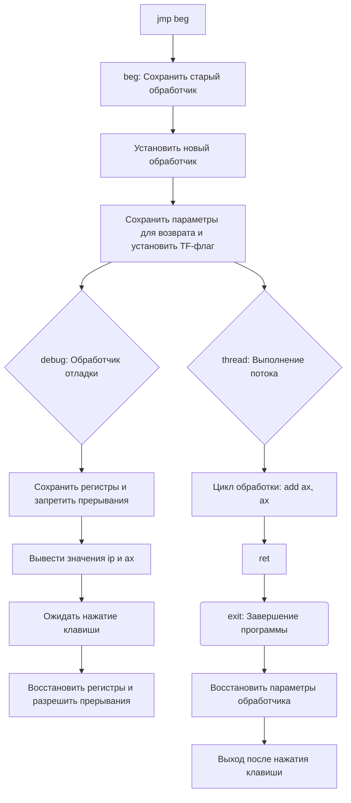

```mermaid
graph TD
    A[jmp beg] --> B[beg: Сохранить старый обработчик]
    B --> C[Установить новый обработчик]
    C --> D[Сохранить параметры для возврата и установить TF-флаг]
    D --> E{thread: Выполнение потока}
    E --> F[Цикл обработки: add ax, ax]
    F --> G[ret]
    D --> H{debug: Обработчик отладки}
    H --> I[Сохранить регистры и запретить прерывания]
    I --> J[Вывести значения ip и ax]
    J --> K[Ожидать нажатие клавиши]
    K --> L[Восстановить регистры и разрешить прерывания]
    G --> M(exit: Завершение программы)
    M --> N[Восстановить параметры обработчика]
    N --> O[Выход после нажатия клавиши]
```
