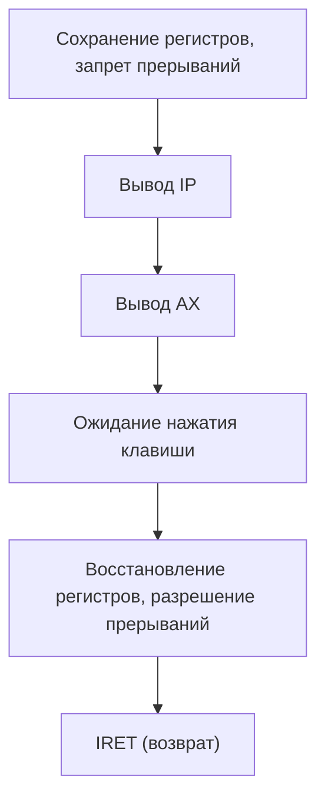
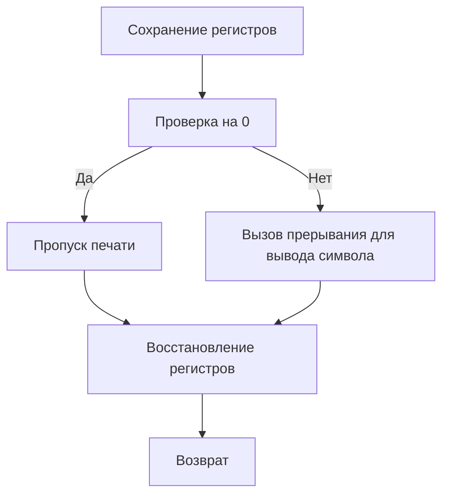
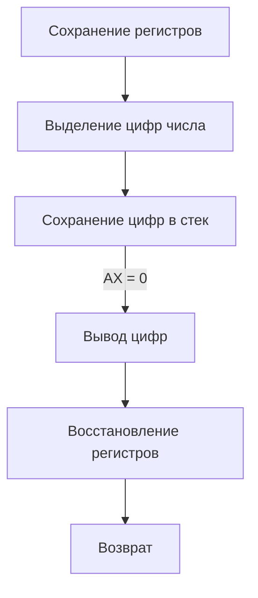
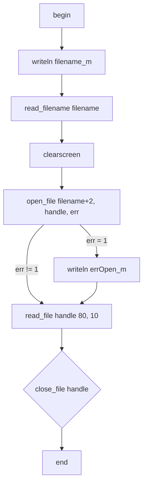
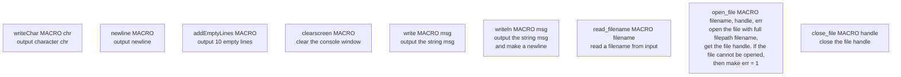

![[asm1.png]]
```mermaid
flowchart TD
    Start["Начало программы"] --> InitData["Инициализация сегментов данных"]
    InitData --> Input["Считывание строки в массив buf"]
    Input --> NewLine["Перенос каретки консоли на новую строку"]
    NewLine --> CountChars["Подсчет количества каждого символа"]
    CountChars --> CheckEndCount["Проверка достижения последнего символа"]
    CheckEndCount -->|Да| StartDiagram["Начало построения диаграммы"]
    CheckEndCount -->|Нет| CountChars
    StartDiagram --> OutputLine["Построение и вывод одной строки диаграммы"]
    OutputLine --> ResetOutput["Возврат массива вывода в начальное состояние"]
    ResetOutput --> CheckDiagramEnd["Проверка завершения диаграммы"]
    CheckDiagramEnd -->|Нет| OutputLine
    CheckDiagramEnd -->|Да| End["Завершение программы"]
id1[/Some text/]id1{{Some text}}


```id1[/Some text/]id1{{Some text}}id1{Some text}


![[тест.png]]
main
```mermaid
flowchart TD
    Start["Начало программы"] --> JumpBeg["Перейти на начало (jmp beg)"]
    JumpBeg --> DebugHandler["Сохранение старого обработчика прерывания"]
    DebugHandler --> SetNewHandler["Установка нового обработчика (TF флаг)"]
    SetNewHandler --> ThreadExec["Выполнение отлаживаемого кода (thread)"]
    ThreadExec --> ExitHandler["Восстановление старого обработчика"]
    ExitHandler --> WaitKey["Ожидание нажатия клавиши"]
    WaitKey --> ProgramEnd["Завершение программы"]
```


debug

print_symbol


Print_number



